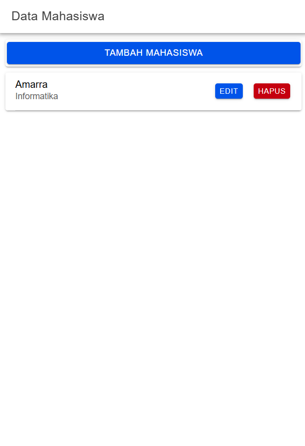

1. Halaman Awal
Setelah menjalankan proyek Ionic, pengguna akan disambut dengan tampilan yang mencakup header dengan judul "Data Mahasiswa". Di bawah header, ada tombol "TAMBAH MAHASISWA" yang dapat digunakan untuk menambahkan data mahasiswa. Berikutnya, akan ditampilkan daftar mahasiswa yang diambil dari database, yang mencakup nama dan jurusan mahasiswa, serta dua tombol, yaitu "EDIT" dan "HAPUS" untuk mengubah atau menghapus data mahasiswa.

3. Proses Tambah Data
Saat pengguna menekan tombol "TAMBAH MAHASISWA", form untuk menambah data mahasiswa akan muncul. Pada bagian kiri atas form, terdapat tombol "BATAL" yang dapat digunakan untuk membatalkan pengisian form dan menutup form tanpa menyimpan perubahan. Di dalam form terdapat dua field yang harus diisi, yaitu Nama Mahasiswa dan Jurusan Mahasiswa. Setelah mengisi kedua field tersebut, pengguna dapat menekan tombol "TAMBAH MAHASISWA" yang terletak di bawah form untuk mengirimkan data yang telah dimasukkan ke dalam database. Dengan menekan tombol tersebut, data mahasiswa yang baru akan disimpan dan ditampilkan di daftar mahasiswa.

Ini adalah tampilan setelah menambahkan data.

3. Proses Edit Data
Saat pengguna menekan tombol "EDIT" pada salah satu data mahasiswa, form untuk mengedit data mahasiswa akan muncul. Tampilan form ini hampir sama dengan form untuk menambah data mahasiswa, namun kali ini isinya sudah terisi dengan informasi mahasiswa yang dipilih sebelumnya. Pengguna dapat melakukan perubahan pada data tersebut, seperti mengganti nama atau jurusan mahasiswa. Setelah melakukan perubahan yang diinginkan, pengguna dapat menekan tombol "EDIT MAHASISWA" yang terletak di bagian bawah form. Tombol ini berfungsi untuk mengirimkan perubahan yang telah dilakukan ke database, memperbarui data mahasiswa yang ada dengan informasi terbaru yang telah diubah. Dengan cara ini, pengguna dapat mengelola dan memperbarui data mahasiswa dengan mudah.

Ini adalah tampilan setelah data di edit.

4. Proses Hapus Data
Ketika pengguna menekan tombol "HAPUS" pada salah satu data mahasiswa, sistem akan menampilkan sebuah pop-up konfirmasi untuk memastikan apakah pengguna benar-benar ingin menghapus data tersebut. Pop-up ini akan menampilkan pertanyaan, yaitu "Apakah data ingin dihapus?", dengan dua pilihan respons yang tersedia: "TIDAK" dan "YA". Jika pengguna memilih "YA", maka data mahasiswa tersebut akan dihapus dari sistem dan database. Namun, jika pengguna memilih "TIDAK", maka penghapusan data akan dibatalkan, dan data tersebut tetap berada di dalam sistem. Fitur konfirmasi ini bertujuan untuk mencegah kesalahan penghapusan data yang tidak diinginkan dengan memberikan pengguna kesempatan untuk memeriksa kembali keputusan mereka sebelum tindakan penghapusan dilakukan.

